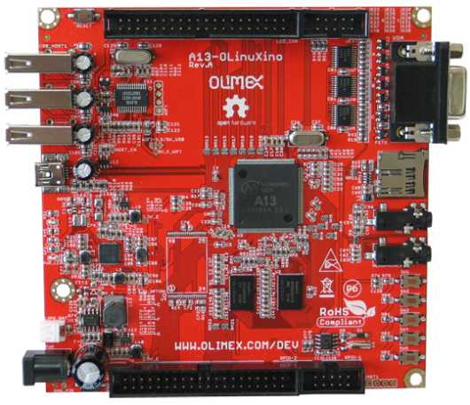

# meta-olinuxino-a13

## Instruction how to build an image for Olinuxino A13(WiFi, NAND as option) in Yocto

### Products:

Olinuxino (Allwinner A13)  
 

  

## General Note:
Assumed that Linux Ubuntu is installed

## List of tested elements

## List of not tested elements

Many elements ;)  

## How to build an images

1. First make sure to following packages are installed in system

    ***sudo apt-get install gawk wget git-core diffstat unzip texinfo gcc-multilib build-essential chrpath socat libsdl1.2-dev xterm libncurses-dev***

    **Note:**
    More informations can be found on Yocto reference manual.

2. Download necessary Yocto packaged listed below

    ***mkdir yocto*** 
    ***cd yocto***  
    ***mkdir build*** 
    ***git clone git://git.yoctoproject.org/poky --depth 1 -b dunfell***  
    ***cd poky***  
    ***git clone git://git.openembedded.org/meta-openembedded --depth 1 -b dunfell***  
    ***git clone https://github.com/meta-qt5/meta-qt5.git --depth 1 -b dunfell***  
    ***git clone https://github.com/voloviq/meta-olinuxino-a13 --depth 1 -b dunfell***  

3. Select directory to build Linux
    
    Be sure to be in ../yocto/poky folder !
    
    ***source oe-init-build-env ~/yocto/build/olinuxino-a13***  

4. Modify bblayers.conf(located in ~/yocto/build/olinuxino-a13/conf)

    *BBLAYERS ?= " \\\
      ${HOME}/yocto/poky/meta \\\
      ${HOME}/yocto/poky/meta-poky \\\
      ${HOME}/yocto/poky/meta-openembedded/meta-oe \\\
      ${HOME}/yocto/poky/meta-openembedded/meta-networking \\\
      ${HOME}/yocto/poky/meta-openembedded/meta-python \\\
      ${HOME}/yocto/poky/meta-qt5 \\\
      ${HOME}/yocto/poky/olinuxino-a13 \\\
      "* 

    **Note:** Please adapt PATH of conf/bblayers.conf if necessary.  

5. Modify local.conf(located in ~/yocto/build/olinuxino-a13/conf) file

    - modify line with "MACHINE ??" to add "olinuxino-a13"

    - align *DL_DIR = "${HOME}/yocto/downloads"*  

    - align *SSTATE_DIR = "${HOME}/yocto/sstate-cache"*  

    - align *TMPDIR = "${HOME}/yocto/tmp"*  

    - add at the end following records    
        *RM_OLD_IMAGE = "1"*  
    *INHERIT += "rm_work"*  

    **Note:** Please adapt rest of conf/local.conf parameters if necessary.  

6. Build objects

    - console image  
      ***bitbake console-image***  

    - qt5 image  
      ***bitbake qt5-image***  

    - qt5 toolchain sdk  
      ***bitbake meta-toolchain-qt5***  

7. After compilation images appears in

    *~/yocto/tmp/deploy/images/olinuxino-a13*  
    
8. Insert SD CARD into dedicated CARD slot and issue following command to write an image

    **Note:**  
    Be 100% sure to provide a valid device name (of=/dev/sde/mmcblk0). Wrong name "/dev/sde/mmcblk0" dameage Your system file !

    **Olinuxino (Allwinner A13)**  
    sudo dd if=~/yocto/tmp/deploy/images/olinuxino-a13-1/console-image-olinuxino-a13.olinuxino-a13-sdimg of=/dev/sdf bs=1024

# Limitation

    - gpu is probably not working
    - no wiringpi or similar library to driver GPIO in C code
